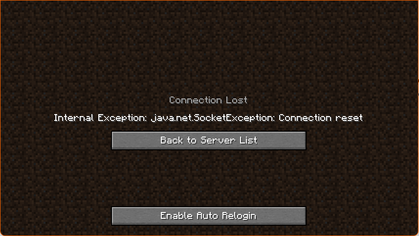

<h1> Auto Reconnect Mod </h1>

In 1.18.1, there seems to be a bug where sometimes after ~20 seconds of joining a server, it kicks you out due to a ```java.net.SocketException```. I rather have to keep joining the world until it finally lets me login. I made this mod to auto-reconnect you if you end up leaving because of this.

<h3> How to use: </h3>
When you encounter a Socket Exception, a button will appear suggesting enabling auto login.


Clicking this button will immediately start the process of logging you in once you disconnect due to a SocketException

You will be asked to re-enable the Auto Login upon the first SocketException of a server session.


<h3>How it works: </h3>
When you leave a server, the code will check if the cause of disconnection was a SocketException.

If it is, it will record the ip & port. It will also record that the reason of disconnection was in fact a socket exception.

When the error screen loads, it will check if the enable auto reconnect button was clicked yet. If it wasn't it will show the button, otherwise, it will use the previously recorded address to try logging back in.

Once you go to the Join Multiplayer Screen again, it will disable the autoconnect and make you press the button again. This is so that you don't have to restart to stop the cycle.

<h3> FAQ: </h3>

* Will you update this mod for version so and so?
  * Most likely, no. If I have time, or feel like it, maybe, but it seems like it only effects 1.18, so that is the version I'll stick with.
* Fabric?
  * Most likely, no. I use forge. This was my first modding experience, and it was hard enough to try finding documentation for forge, I don't want to do it all again.
* Is it bug free?
  * Possibly? Maybe? If you find a bug, please let me know. I'll try to fix it, but I also have schoolwork to do.
* Is it a virus?
  * No malice-intent was put into this, the code is open-source, so you can see for yourself.